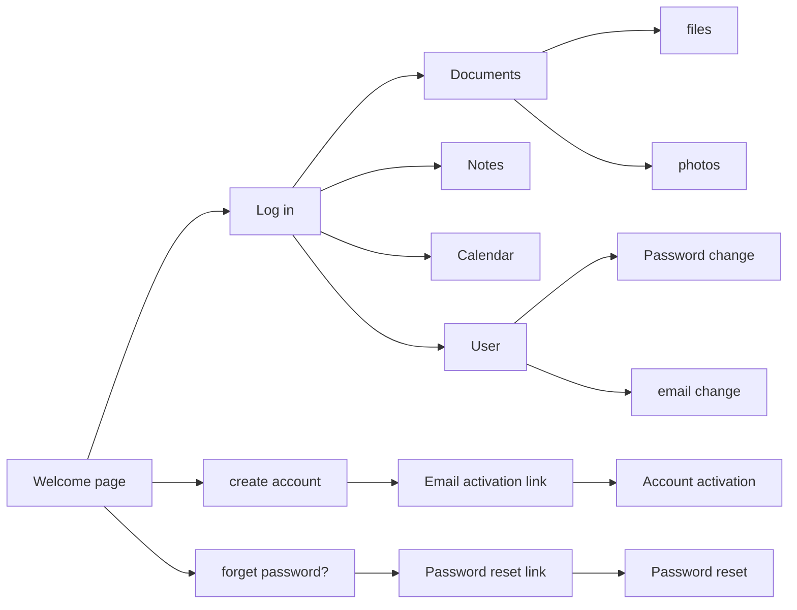

# Welcome in Cloudlet App

## Your easy access and fast private space in internet

This application let you to store documents and photos by the easiest and fastest way. Also you can write quick notes, match you task on calendar and adjust email reminders.

## Application map

## Languange 

Service is in Polish, there are plans for English version

## About App

Application was made with React and TypeScript. Global store is handled by redux with redux toolkit.

Additional packages:

- full calendar

- js-file-download

- Sass preprocessor

- react-router

Minimum screen width is 320px. To this value app is fully responsive

## How to start ?

After cloning this repository use node package manager to install all required node modules

- npm install

Before you start make sure that you have correct backend address value in connection.config.ts

To start developer server:

- npm start

To build static production  version:

- npm run build

## Back-end

Backend for this app you can find in my repository: https://github.com/darone90/cloudlet_back

## Contact

If you want to reach me use my email address: pileckidariusz90@gmail.com

## Copyrights

All code in this repository is free to use for everyone

